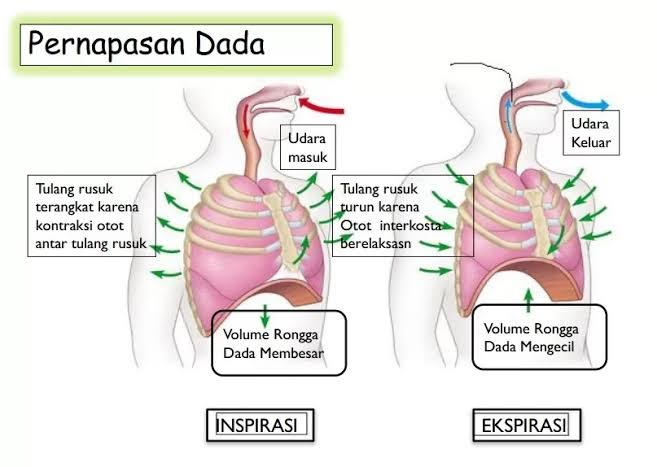
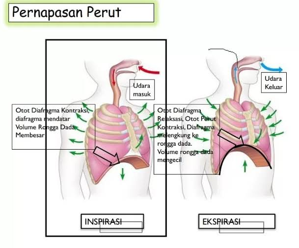

Bernapas adalah kegiatan tubuh kita yang dilakukan secara tidak sadar. Kita membutuhkan bernapas untuk bisa bertahan hidup. Namun, pernahkah terbenak di pikiran kalian sebuah pertanyaan bagaimanakah proses bernapas itu?

<!--more-->

## Pengertian Pernapasan

Secara singkat, **respirasi** atau **pernapasan** adalah sebuah proses pengambilan oksigen (O2) yang terkandung dalam udara dari lingkungan luar ke dalam tubuh dan pengeluaran karbon dioksida (CO2) dari dalam tubuh ke lingkungan. Respirasi bertujuan untuk mendapatkan energi, sehingga kita dapat bertahan hidup dan beraktivitas.

Tahukah kalian, ternyata berdasarkan otot yang terlibat, pernapasan yang kita lakukan itu terbagi menjadi dua loh, yaitu pernapasan dada dan pernapasan perut.

## Pernapasan Dada

**Pernapasan dada** adalah pernapasan yang melibatkan otot antar tulang rusuk atau interkostal. Proses pernapasan ini berperan sebagai pemicu kontraksi dan relaksasi rongga dada. Prosesnya, saat tubuh menarik napas, otot interkostal akan berkontraksi sampai rongga dada mengembang dan kembali lagi ke posisi semula.

Menurut _NHS_ (National Health Service - UK), pernapasan dada ditandai dengan gerakan dada ke atas dan keluar. Jenis pernapasan ini umumnya terjadi saat berolahraga berat atau dalam situasi darurat. Apabila kita menggunakan pernapasan dada secara terus-menerus, maka dapat membuat tubuh tegang. Hal ini disebabkan oleh aktivasi otot dada bagian atas saat pernapasan dada terjadi dapat meningkatkan kecemasan.

## Mekanisme Pernapasan Dada

**Fase Inspirasi (Pengambilan Napas)**

- Otot antar tulang rusuk atau interkostal berkontraksi.
- Volume rongga dada dan paru-paru membesar.
- Tekanan udara dalam paru-paru lebih kecil dibandingkan tekanan udara di luar.
- Udara masuk ke dalam paru-paru.

**Fase Ekspirasi (Pengeluaran Napas)**

- Otot antar tulang rusuk berelaksasi.
- Volume rongga dada dan paru-paru mengecil.
- Tekanan udara dalam paru-paru lebih besar dibandingkan tekanan udara di luar.
- Udara keluar dari dalam paru-paru.

## Pernapasan Perut

**Pernapasan dada** adalah pernapasan yang melibatkan otot diafragma sebagai penggerak utamanya. Saat menghembuskan napas, otot diafragma akan rileks dan bergerak ke atas, sedangkan otot interkostal akan berkontraksi dan menarik tulang rusuk ke bawah. Hal ini menyebabkan volume rongga dada mengecil dan udara terdorong keluar dari paru-paru. Pergerakan otot diafragma yang berlawanan dengan otot interkostal ini merupakan ciri khas pernapasan perut. Oleh karena itu, pernapasan perut juga dikenal sebagai _diaphragmatic breathing_ atau pernapasan diafragma.

## Mekanisme Pernapasan Perut

**Fase Inspirasi (Pengambilan Napas)**

- Otot diafragma berkontraksi.
- Volume rongga dada membesar dan diafragma mendatar.
- Tekanan udara mengecil dan paru-paru mengembang.
- Tekanan udara di dalam paru-paru lebih kecil dibandingkan tekanan udara di luar.
- Udara masuk ke dalam paru-paru.

**Fase Ekspirasi (Pengeluaran Napas)**

- Otot diafragma berelaksasi.
- Otot dinding perut berkontraksi.
- Diafragma terangkat dan kemudian menekan rongga dada.
- Volume rongga dada mengecil.
- Tekanan udara di dalam paru-paru lebih besar dibandingkan tekanan udara di luar.
- Udara keluar dari dalam paru-paru.

Itu dia mekanisme pernapasan dada dan perut atau diafragma saat di fase inspirasi dan ekspirasi. Semoga postingan ini bermanfaat ya!!
