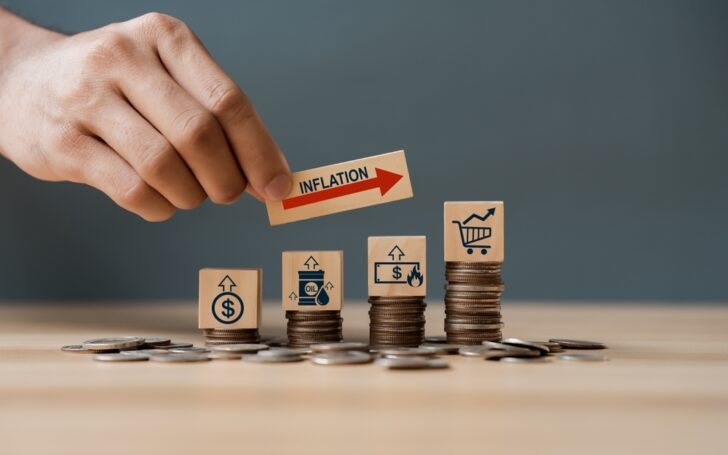

Inflasi merupakan fenomena ekonomi yang hampir semua orang pernah dengar dan rasakan dampaknya, tetapi mungkin belum sepenuhnya memahami apa itu inflasi secara mendalam. Nah, di artikel kali ini, kita akan mengulas pengertian inflasi secara mendalam serta teori-teori yang mendasarinya untuk memberikan pemahaman yang lebih menyeluruh mengenai fenomena ini.

<!--more-->

## Definisi Inflasi

Inflasi

**Inflasi** adalah fenomena ekonomi yang ditandai dengan kenaikan harga barang dan jasa secara umum dan terus-menerus dalam jangka waktu tertentu. Ketika inflasi terjadi, daya beli uang menurun karena jumlah uang yang sama tidak lagi dapat membeli jumlah barang atau jasa yang sama. Namun, yang perlu kita ketahui adalah tidak semua kenaikan yang terjadi bisa dikatakan inflasi. Jika kenaikan itu hanya terjadi pada saat-saat tertentu, misalnya ketika menjelang lebaran, maka kenaikan harga barang-barang tersebut tidak dapat dikatakan inflasi.

Inflasi dikatakan sebagai kenaikan harga-harga barang atau jasa secara umum karena dalam inflasi, sebagian besar barang mengalami kenaikan harga, meskipun ada sebagian kecil barang atau jasa yang harganya tidak naik atau bahkan mungkin turun. Selain itu, inflasi dikatakan sebagai kenaikan yang terjadi secara terus-menerus karena kenaikan harga dari satu atau dua barang saja tidak cukup dikatakan sebagai inflasi, kecuali jika kenaikan tersebut juga mengakibatkan sebagian besar harga barang lainnya mengalami kenaikan.

Inflasi biasanya diukur menggunakan Indeks Harga Konsumen (IHK) yang menghitung perubahan harga dari sejumlah barang dan jasa yang sering dibeli oleh rumah tangga. Selain IHK, Indeks Harga Produsen (IHP) juga bisa digunakan untuk mengukur inflasi dari sisi produsen.

## Teori-Teori tentang Inflasi

Untuk memahami inflasi lebih dalam, para ekonom telah mengembangkan berbagai teori yang menjelaskan penyebab dan mekanisme terjadinya inflasi. Berikut adalah beberapa teori utama mengenai inflasi:

### 1. Teori Kuantitas Uang (_Quantity Theory of Money_)

Teori ini dipelopori oleh seorang pakar ekonom bernama **Irving Fisher**. Teori ini menyatakan bahwa inflasi disebabkan oleh pertambahan jumlah uang yang beredar dalam perekonomian dan anggapan masyarakat terhadap kenaikan harga-harga barang (faktor psikologis). Teori ini mempunyai rumus sebagai berikut:

$$ \large{\bf MV = PT} $$

dimana:
- M = jumlah uang yang beredar (_money_).
- V = kecepatan peredaran uang (_velocity of circulation money_).
- P = harga barang (_price_).
- T = jumlah barang yang diperdagangkan (_trade_).

Menurut teori ini, ketika jumlah uang beredar meningkat lebih cepat daripada jumlah barang dan jasa yang diproduksi, maka harga-harga akan naik dan terjadilah inflasi. Dengan kata lain, inflasi terjadi karena terlalu banyak uang yang beredar, namun produksi barang dan jasa sedikit.

### 2. Teori Keynes

Teori Keynes dikemukakan oleh **Keynes**, dimana ia menjelaskan bahwa inflasi terjadi karena ada sebagian masyarakat yang ingin hidup di luar batas kemampuan ekonominya. Teori ini menjelaskan bahwa proses inflasi merupakan proses perebutan bagian rezeki di antara kelompok-kelompok masyarakat yang menginginkan bagian yang lebih besar dari yang bisa disediakan oleh kelompok masyarakat tersebut.

Hal ini terlihat pada tingginya permintaan masyarakat terhadap barang-barang yang selalu melebihi jumlah stok barang yang tersedia, sehingga mendorong harga barang menjadi naik. Menurut Keynes, ketidakseimbangan ini menciptakan _inflationary gap_.

Keadaan ini sering terjadi ketika masyarakat, pemerintah, dan sektor bisnis ingin memperoleh lebih banyak sumber daya dari sumber daya yang tersedia, sehingga menciptakan persaingan yang menyebabkan harga terus meningkat. Misalnya, pemerintah mencetak banyak uang untuk menutupi defisit anggaran. Contoh lain, misalnya suatu perusahaan ingin meningkatkan produksi tanpa penawaran barang yang cukup. Inflasi menurut Keynes dapat dipicu juga oleh kenaikan biaya produksi, seperti peningkatan upah karyawan atau kenaikan harga bahan baku yang berakibat pada naiknya harga barang akhir.

### 3. Teori Strukturalis

Teori strukturalis berkembang dari kajian ekonomi negara-negara Amerika Latin dan berfokus pada faktor-faktor struktural yang menciptakan inflasi di negara- negara berkembang. Menurut teori ini, inflasi bukan hanya disebabkan oleh ketidakseimbangan antara penawaran dan permintaan, tetapi juga karena adanya kondisi struktur ekonomi sebagai berikut.

1. **Ketidakelastisan Penerimaan Ekspor** 
Ini berarti bahwa penerimaan atau pendapatan yang diperoleh dari ekspor tidak mudah berubah, meskipun ada perubahan harga di pasar internasional. Ketika harga barang ekspor meningkat, idealnya, penerimaan ekspor juga akan naik. Namun, dalam kasus ketidakelastisan, pendapatan tetap atau tumbuh lambat karena barang ekspor dari negara berkembang seringkali berupa bahan mentah yang harganya cenderung tidak stabil dan sensitif terhadap permintaan global. Selain itu, negara berkembang cenderung memiliki daya saing yang terbatas untuk meningkatkan kualitas atau diversifikasi produk yang diekspor, sehingga tidak ada peningkatan yang berarti dalam penerimaan ekspor mereka.

2. **Ketidakelastisan Penawaran atau Produksi Makanan di Dalam Negeri** 
Kondisi ini merujuk pada kesulitan untuk meningkatkan produksi pangan dalam negeri, meskipun ada kenaikan permintaan atau harga. Misalnya, peningkatan permintaan bahan makanan seperti beras atau jagung tidak langsung meningkatkan produksi karena berbagai kendala, seperti keterbatasan lahan, teknologi, dan infrastruktur pertanian yang masih kurang berkembang. Akibatnya, kenaikan permintaan pangan dalam negeri lebih cenderung mendorong kenaikan harga daripada peningkatan produksi, yang bisa memicu inflasi.

Itu dia penjelasan mendalam mengenai pengertian inflasi dan teori-teorinya. Semoga postingan ini bermanfaat!!
